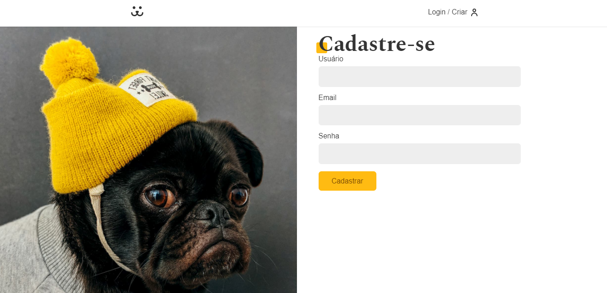
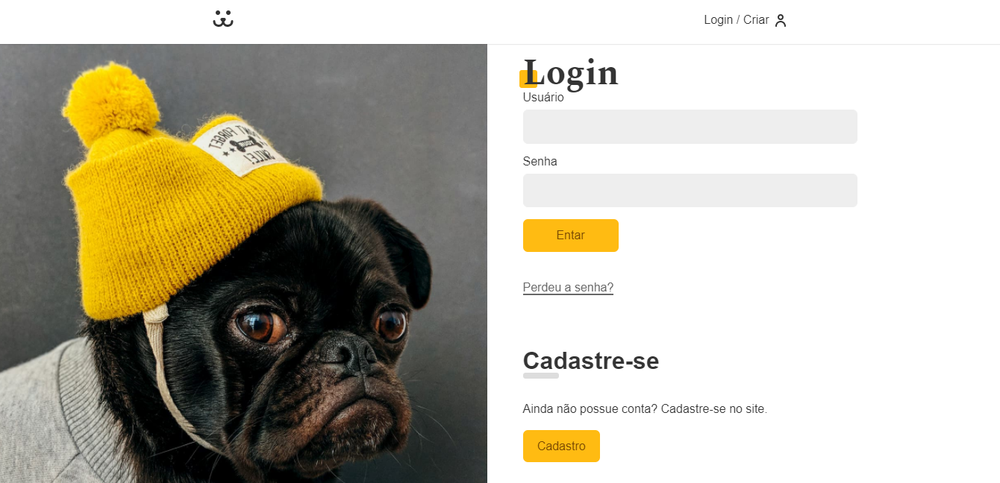
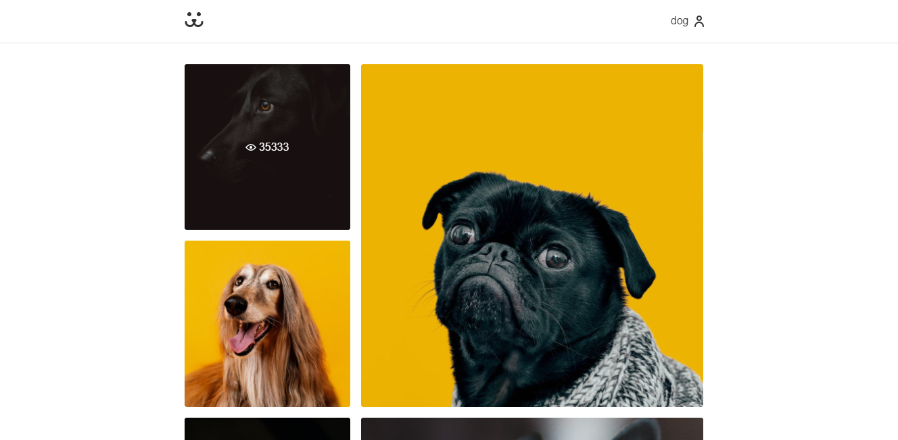

<h1 align="center"> Projeto curso origamid 👋</h1>
<p>
  
  <a href="https://github.com/irailtonreis/frontend-be-te-hero#readme" target="_blank">
    
  </a>
  <a href="https://github.com/irailtonreis/frontend-be-te-hero/licence" target="_blank">
    
  </a>
</p>

## Install

```sh
npm install
```

## Usage

```sh
npm run start
```
## Author

👤 **irailton**

* Github: [@irailtonreis](https://github.com/irailtonreis)
* LinkedIn: [@irailtonreis](https://linkedin.com/in/irailtonreis)

## Frontend - Interfaces

### 1. Registro de um Cachorro


### 2. Login


### 3. Feed de fotos


## 📝 License
Copyright © 2020 [irailton](https://github.com/irailtonreis).<br />
This project is [MIT](https://github.com/irailtonreis/frontend-be-the-hero/licence) licensed.

***
_This README was generated with ❤️ by [readme-md-generator](https://github.com/kefranabg/readme-md-generator)_